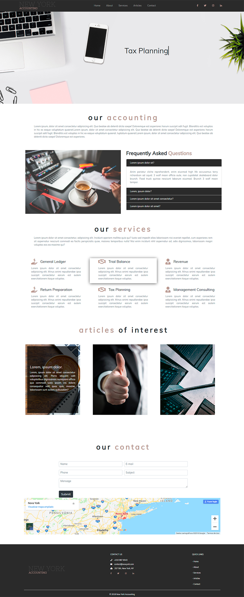

<h1 align="center">TEMPLATE HTML5 RESPONSIVO</h1>

<h1 align="center"></h1>

## 👀 Sobre

#### EXERCITANDO AS TECNOLOGIAS MAIS ATUAIS E MELHORES PRÁTICAS.

---

## Tecnologias Utilizadas

- Html5
- Css3
- Javascript
- Bootstrap

## Bibliotecas

- Jquery
- animation

___
<h1 align="center"><a href="http://amandavasconcelos.com/NewYorkAccounting/index.html" target="_blank">Demonstração</a></h1>